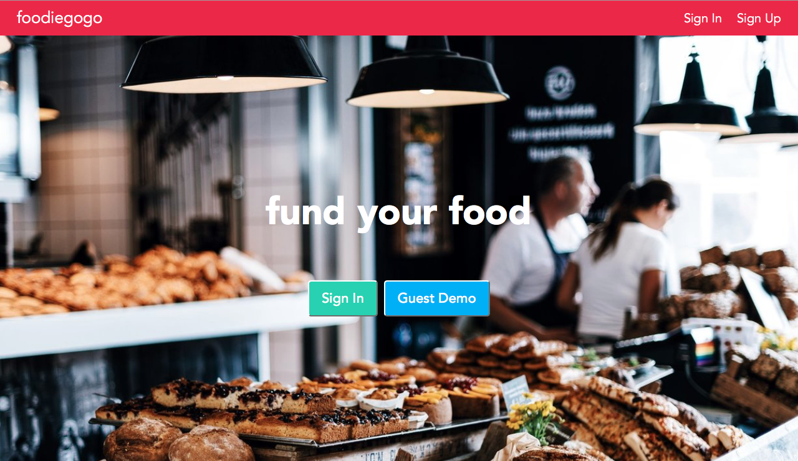
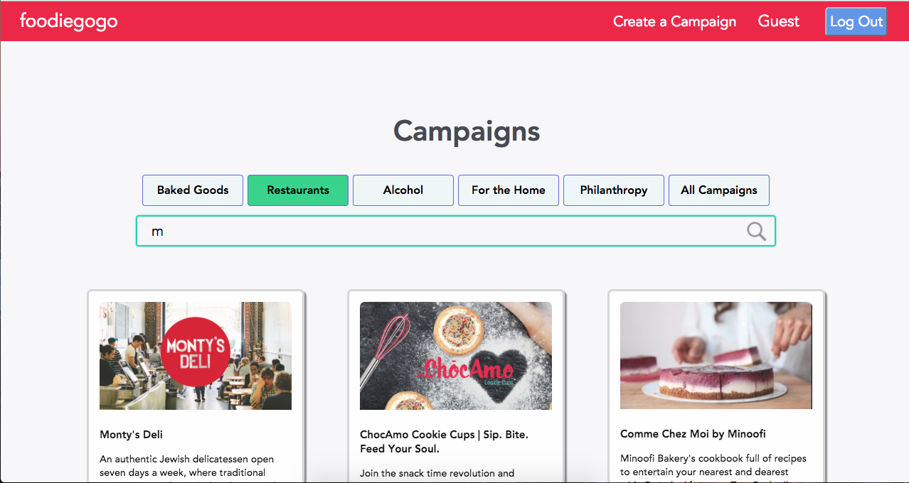
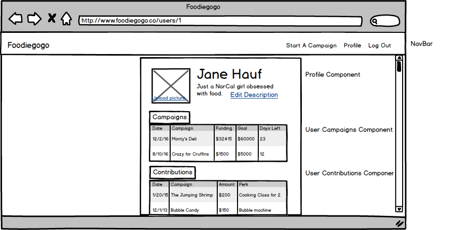

# foodiegogo

foodiegogo [live][heroku]

 [heroku]: http://www.foodiegogo.co

foodiegogo is a full-stack web application inspired by indiegogo.  It utilizes Ruby on Rails on the backend, a PostgreSQL database, and React.js with a Redux architectural framework on the frontend.

  

## Features & Implementation


### Campaigns
  On the database side, the campaigns are stored in one table in the database. Campaigns are rendered in two different components: the Campaign Index as well as the Campaign Show page. The Campaign's Index renders the pictures, titles and descriptions and gets the data by sending a GET request to the Campaign Controller's Index Route. The Campaign Show page features a video, days left, current funding, goal funding, as well a Contributions Index Component which renders a list of Contribution Index Items.

  


### Perks
  Perks are stored in the database with a name, donation amount, description and campaign_id. Each campaign has a number of perks which are fetched from the backend upon entering the `Campaign Show` page by sending a GET request to the Campaigns index route with params of `:campaign_id`. Clicking on a perk opens the contribution form which on submit creates a new contribution.

  ```js
    export const fetchPerks = (id, success) => {
      $.ajax({
        url: `api/campaigns/${id}/perks`,
        type: "GET",
        success
      });
    };
    ```

  ```js
  def index
    @campaign = Campaign.find(params[:campaign_id])
    @perks = @campaign.perks
  end
  ```


### Contributions
  In the backend, contributions are stored in a contributions table with an id, date, donation amount, campaign_id, contributor_id, perk_id. Each campaign's page displays a list of contributions, with the date, donation amount and contributor's name. Each time a contribution is made, the current funding of the campaign and the contributions table are updated in the Contributions Controller .


### Search
  Searching by campaign name is another feature of foodiegogo. Each time a user makes a keystroke, the internal state of the Search Component is updated and afterwards, the database is re-queried, which updates the Campaigns slice of state.

### Categories
  My app allows users to filter campaigns by categories. This is done on the frontend by filtering and updating the campaigns piece of state each time a user selects a category.

## Future Directions for the Project

In addition to the features already implemented, I plan on adding the following features to the project.

### Profiles
  Each user will have a profile which will display their basic information, profile picture, the campaigns they have started as well as the campaigns they have contributed to.

  

### Google Maps API
  For the restaurants, I plan to integrate my app with Google Maps to allow users to search for new restaurants starting in their area.
